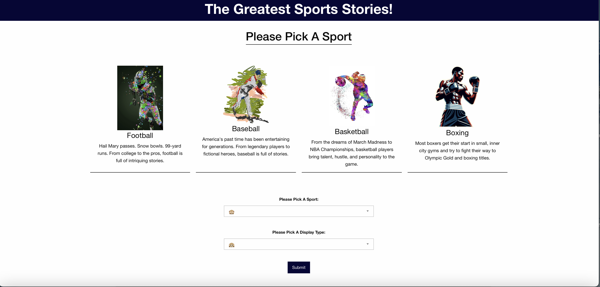

# The Greatest Sports Stories

A repo for our first group Project at Vanderbilt University. The purpose of this repo to is introduce us to group work, a agile mindset, and meeting deadlines while working on a team.

## Table of contents
N/A

## Usage 

In this repo, we created a page that will atttract any sports fanatic. To use this page, a user must select a sport and medium then they will be presented with popular items that are relevent to that medium and sport. 

Please try for yourself:https://antoniohockman.github.io/Great-Sports-Movies-of-all-time-/

## Credits:
N/A

## License

MIT License 